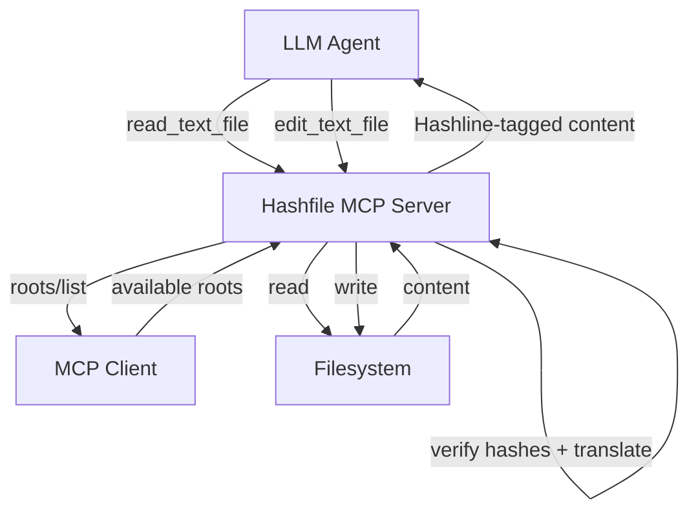

# Hashfile MCP Server: Idea & Design

## Overview

The Hashfile MCP Server is a standalone Model Context Protocol (MCP) server implemented in Rust that provides reliable file reading and editing capabilities using the **Hashline** concept.

Traditional file editing tools for LLM agents often suffer from reliability issues (silent corruption, context window waste) because they rely on exact substring matching. Hashfile solves this by anchoring edits to per-line content hashes.

## The Hashline Concept

**Core Idea**: Tag every line in file reads with a short content hash. The model uses these hashes as anchors when editing, instead of reproducing original text.

### Read Output Format

When reading a file via `read_text_file`, each line is prefixed with its line number and a 2-character hex hash suffix derived from its content:

```text
1:a3|function hello() {
2:f1|  return "world";
3:0e|}
```

Format: `{lineNumber}:{hash}|{content}`

- **Line number**: 1-indexed.
- **Hash**: 2-character hex derived from line content (FNV-1a lowest byte).
- **Pipe separator**: Delineates metadata from content.

### Edit Operations via Hashes

The `edit_text_file` tool accepts hash-anchored operations:

| Operation       | Description                  | Example                                       |
| --------------- | ---------------------------- | --------------------------------------------- |
| `replace`       | Replace specific line(s)     | `replace 2:f1 with '  return "hello";'`       |
| `replace_range` | Replace a range of lines     | `replace 1:a3..3:0e with <new content>`       |
| `insert_after`  | Insert line(s) after anchor  | `insert_after 2:f1 '  console.log("debug");'` |
| `insert_before` | Insert line(s) before anchor | `insert_before 1:a3 '// greeting function'`   |
| `delete`        | Remove line(s)               | `delete 2:f1`                                 |
| `delete_range`  | Remove a range               | `delete 1:a3..3:0e`                           |

## Safety Guarantees

1.  **Staleness Detection**: If the file changed since the read, line hashes won't match, and the edit is rejected.
2.  **Anchor Confidence**: Probabilistically ensures the model is editing exactly what it intended.
3.  **Efficiency**: Eliminates the need for the model to reproduce large blocks of original text (`oldText`), saving context window tokens.
4.  **Path Validation**: The server validates all paths against the list of **MCP Roots** exposed by the client.

## Technical Design (Rust + `rmcp`)

### Architecture

The server is built using the `rmcp` Rust crate (`v0.3`) for high-performance MCP implementation. It implements a custom `ServerHandler` to manage tools and roots.



### Components

1.  **Hash Engine**:
    - Implements FNV-1a hashing.
    - Normalizes lines (removes trailing whitespace) before hashing.
    - Generates 2-character hex hashes (1 byte).

2.  **Roots Integration**:
    - During initialization, the server declares `roots` capability.
    - Before any file operation, the server fetches the list of roots via `roots/list` and ensures the target file is within an allowed root.
    - Listens for `notifications/roots/list_changed` to keep the cache up to date.

3.  **Tool Implementation**:
    - Uses `#[tool_router]` and `#[tool]` macros for routing.
    - `read_text_file`: Returns tagged content + SHA-256 `file_hash`.
    - `edit_text_file`: Translates hash-anchored operations to atomic file writes after hash verification.

### Anchor Resolution Algorithm

When an edit is requested:
1.  Verify `file_hash` matches current file content.
2.  For each operation, resolve the anchor (e.g., `2:f1`):
    - Exact match: Check if line 2 still has hash `f1`.
    - Fuzzy match: If line 2 doesn't match, search the file for hash `f1`. If exactly one match is found, treat it as a "moved" line.
    - Error: If hash is not found or ambiguous, reject the edit.

## Implementation Details (Rust)

- **Runtime**: `tokio` (multi-threaded async).
- **Serialization**: `serde` and `serde_json`.
- **MCP Transport**: Stdio (standard input/output).
- **Dependencies**: `anyhow` for error handling, `reqwest` (if needed for remote calls, though mostly local FS), `sha2` for file hashing.

## Implementation Plan

1.  **Phase 1**: Core Logic. Hashing, tagging, and operation translation logic.
2.  **Phase 2**: MCP Roots & Path Validation. Implementing root list fetching and path boundary checks.
3.  **Phase 3**: MCP Server. Setting up `rmcp` handlers and tool registration.
4.  **Phase 4**: Safety & Robustness. Fuzzy matching and integration tests.
